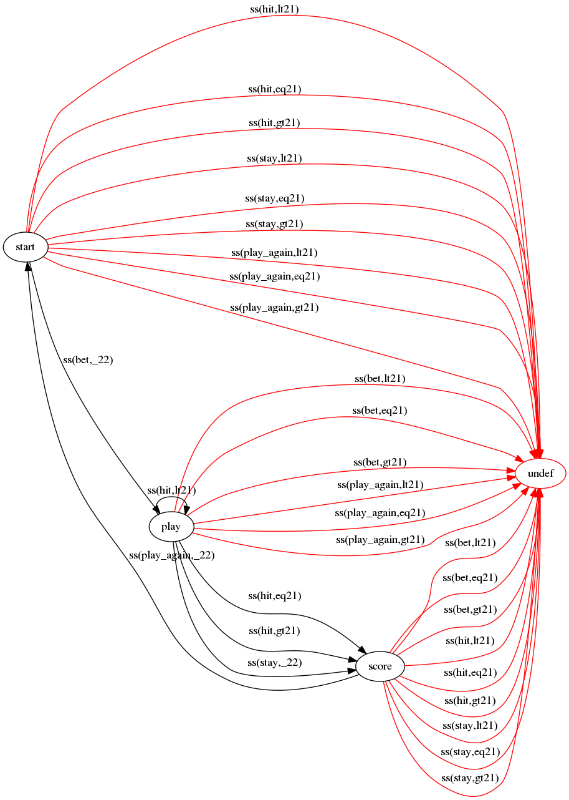

# Introduction

Many software programs or parts of it can be described as a finite state
machine (DFA). For example protocol implementations, user interfaces and web applications. Incomplete DFA specifications can lead to bugs, which can influence usability and also security (e.g. session pollution, and bypassing input validation or authorization checks).

Happyflea is a small tool to detect missing transitions in a DFA. The DFA is described in a simple Prolog file, and Happyflea outputs a [Graphviz](http://www.graphviz.org/) DOT file that shows the DFA transitions, with the missing ones highlighted.


# Installation

To compile the program, you will need the `gplc` compiler, which is part of [GNU Prolog](http://gprolog.org/), and `make`, which should be part of your operating system.

Simply type `make` to build the program.


# Running Happyflea

First you will need to specify your DFA. Let's assume that your DFA is specified in the file `examples/casino.pl`. You can then run Happyflea as follows:

    ./happyflea < examples/casino.pl

You can feed the output to Graphviz to render it:

    ./happyflea < examples/casino.pl  | dot -Tpng Grankdir=LR -o examples/casino.png

The result is:




# Specifying the DFA

A DFA consists of *states* and *transitions* between those states. Whether a transition is followed depends on certain conditions, such as a certain input, or the value of a certain program variable. These are things that need to be modeled.

## Defining the DFA states

In Prolog, we specify the DFA states as follows:

``` prolog
% all defined DFA states
state(start).
state(play).
state(score).
```

One special state with the name `undef` is reserved to 

## Defining the state space

Next we need to define a *state space*. Happyflea expects a predicate `is_ss/1` to determine if something is a state space. It is important that the state space can be completely enumerated, otherwise it is impossible to find all transitions. You can test this by loading your DFA specification in GNU Prolog, and asking it `is_ss(X)`:

```
| ?- is_ss(X).

X = ss(bet,lt21) ? ;

X = ss(bet,eq21) ? 
   :         :
```

In the casino example, we have defined the state space as follows:

``` prolog
is_ss(V) :- operation(V,_), count(V,_).
```

This says that a state space consists of the variables `operation` and `count`. Those are defined as:

``` prolog
operation(ss(Op,_),Op) :- oper(Op).
count(ss(_,Count),Count) :- cnt(Count).
```

That is, we have a functor `ss` that contains the operation and the count. The values that those variables can have are:

``` prolog
% possible values for statespace operation
oper(bet).
oper(hit).
oper(stay).
oper(play_again).

% possible values for statespace count
cnt(lt21).
cnt(eq21).
cnt(gt21).
```

Note that for the `count` variable we have not chosen a numeric value. It is a good idea to keep the range of the state space variables as small as possible, to avoid an explosion of possible state space values. In this case we did not model the count itself, but the three possibilities of it being less than 21, equal to 21 or greater than 21.

## Defining DFA transitions

Now that we have the DFA states and the state space, we can define the DFA transitions. Happyflea expects a predicate `trans(V,S1,S2)` where `V` represents the state space, `S1` the source DFA state and `S2` the destination DFA state. In the casino example, these are:

``` prolog
% DFA transitions
trans(V,start,play) :- operation(V,bet).
trans(V,play,play) :- operation(V,hit), count(V,lt21).
trans(V,play,score) :- operation(V,hit), count(V,eq21).
trans(V,play,score) :- operation(V,hit), count(V,gt21).
trans(V,play,score) :- operation(V,stay).
trans(V,score,start) :- operation(V,play_again).
```

This means that we have a transition from state `play` to state `score` if the operation is `hit` and the count is equal to or greater than 21, or if the operation is `stay`.


